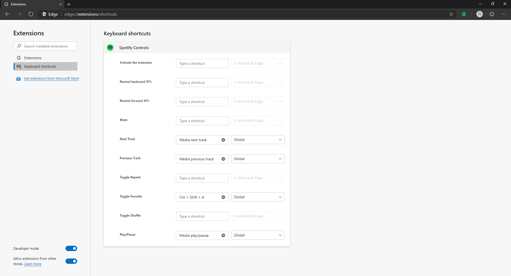
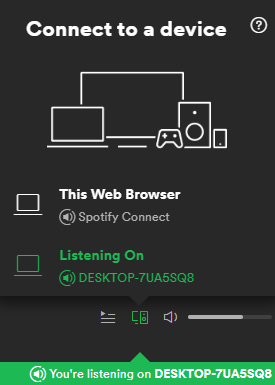

# Spotify Controls
### [Download](https://github.com/KentoNishi/Spotify-Controls/archive/master.zip)
An extension for Spotify shortcuts and controls.

# About
This extension lets you customize and control keyboard shortcuts for Spotify!

# Installation
1. [Download](https://github.com/KentoNishi/Spotify-Controls/archive/master.zip) the file.
2. Unzip the file contents. 
    > When the unzip finishes, make sure you are inside the extracted folder. For example, if you downloaded the file to `Downloads`, make sure you are inside `Downloads/Spotify-Controls-master`.
3. Go to ``chrome:extensions`` and enable developer mode.
4. Drag and drop the extension folder into the ``chrome:extensions`` page.
5. Once the extension is installed, you are good to go!
    > To activate the extension, click on the Spotify icon on the navigation bar.

# Shortcuts
By opening the extension and clicking ``Change shortcuts``, you can set your own custom commands.

# Desktop Integration
You can use this extension alongside the Spotify desktop application.
1. Make sure the extension is installed in your browser.
1. Open the desktop application.
1. Open the web application.
1. Minimize or hide the web application, but make sure it stays open.
1. In the web app, make sure your audio output device is set to the desktop application.

# Optional Features
These features only work on Windows.
## Headphone Hotkeys
Control audio with the media buttons on your headphones.
### Installation
> Make sure your keyboard shortcuts for ``Play/Pause``, ``Next Track``, and ``Previous Track`` are set to their default keys.
1. [Download](https://github.com/KentoNishi/Spotify-Controls/raw/master/Headphone-Controls.exe) the Headphone-Controls executable.
2. Open the executable. Your headphones can now control media playback.
    > The application will not start automatically on boot. The auto-start program is still in the works.

# Issues
* While loading, the player occasionally shows the title as being ``undefined``.
    > Wait for the Spotify app to load.
* If you are using a browser that supports hardware media keys, some keys may not register.
    * In Microsoft Edge on Chromium, the feature can be turned off at ``edge://flags/#hardware-media-key-handling``.
        > Keypresses may not be registered if 2 handlers conflict. Disable either the browser feature or ``Play/Pause``, ``Next Track``, and ``Previous Track`` shortcuts to fix the issue.
        >   * All other shortcuts are unaffected by this conflict.
    * Other Chromium browsers can solve the issue with similar procedures.
* Keys may suddenly stop working.
    > Restart the browser, reload the extension, and restart optional features.
* Shortcuts may not work after changing them.
    > Restart the browser, and open Spotify again.
* Headphone Controls may prevent shortcuts from being pressed quickly.
    > Press the key again, after a short pause of more than 600 milliseconds.    
    
# Credits
* This project is based on [SpotifyControls](https://github.com/Sergej-Popov/SpotifyControls) by [@Sergej-Popov](https://github.com/Sergej-Popov).