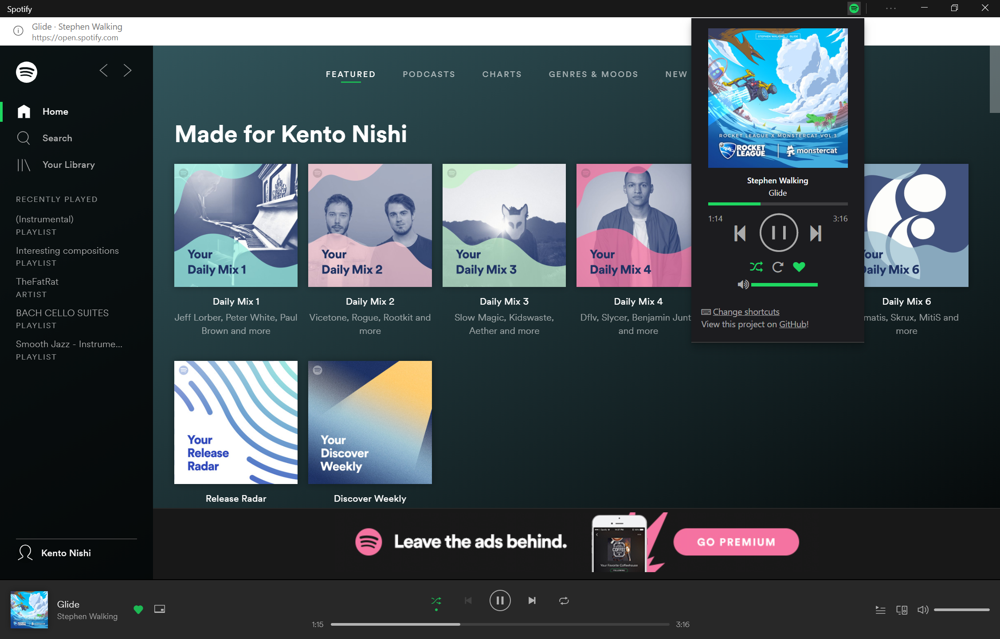

# Spotify Controls
### [Download](https://github.com/KentoNishi/Spotify-Controls/archive/master.zip)
An extension for Spotify shortcuts and controls, based on [SpotifyControls](https://github.com/Sergej-Popov/SpotifyControls) by [@Sergej-Popov](https://github.com/Sergej-Popov).

# Installation
1. [Download](https://github.com/KentoNishi/Spotify-Controls/archive/master.zip) the file.
2. Unzip the file contents.
3. Load the unpackaged extension manually. Make sure developer mode is enabled.
4. Reload Spotify, and you are good to go!